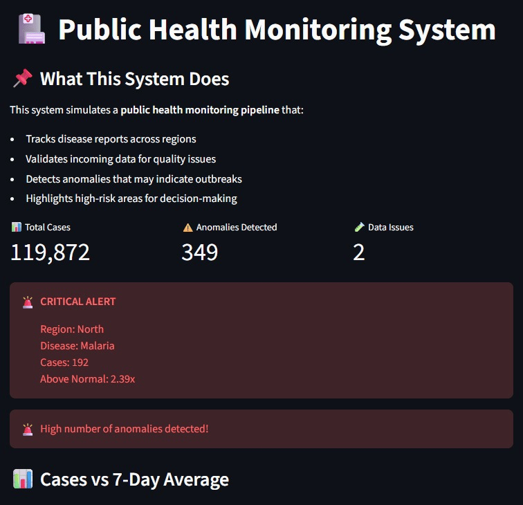
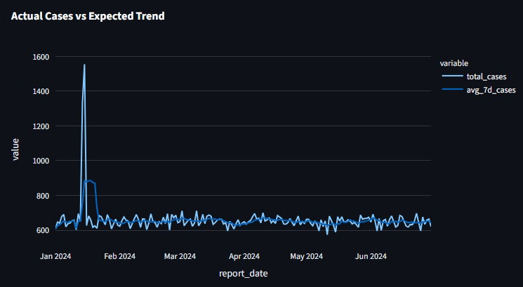
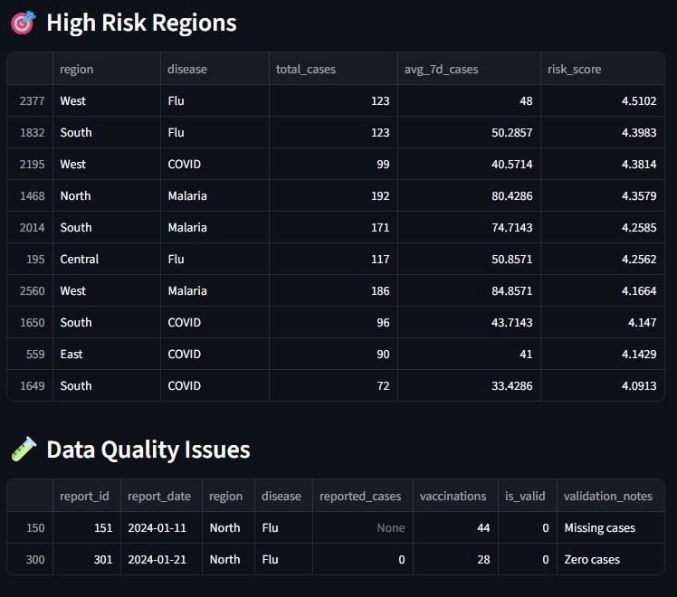

# 🏥 Public Health Monitoring System

A real-world data monitoring system that simulates a **public health data pipeline**, designed to detect anomalies, validate incoming data, and support decision-making through an interactive dashboard.

---

## Dashboard Preview




---

## Key Features

- **Data pipeline (Python + SQL)**
- **Data Validation Engine**: Flags missing, inconsistent, or duplicate records
- **Anomaly Detection**: Identifies abnormal spikes in disease cases
- **Interactive Dashboard** (Streamlit + Plotly)
- **Business Insights & Reporting**
- **Risk Scoring System**: Highlights high-risk regions and diseases
- **Trend Monitoring**: Compares actual vs expected case patterns  
- **Authentication Layer**: Secures dashboard access  
- **Downloadable Reports**: Export anomaly data for analysis 

---

## 💡 Business Impact

This system helps **detect potential disease outbreaks early** by identifying unusual patterns in health data.

It enables:
- Faster response to abnormal case spikes  
- Better prioritization of high-risk regions  
- Improved data quality monitoring  

---

## Use Case

Designed for health officers to monitor:
- Disease trends
- Data quality issues
- Potential outbreak anomalies

---

## Tech Stack

- **Python** (Pandas, NumPy)
- **SQL** (SQLite)
- **Streamlit** (Dashboard UI)
- **Plotly** (Interactive Visualizations)

---
## System Architecture

Data Flow:
CSV → SQL → Validation → Aggregation → Dashboard

Components:
- **Generate Data** - Simulates public health reports  
- **Load Data** - Stores data into SQL database  
- **Validate Data** - Flags missing & inconsistent records  
- **Detect Anomalies** - Identifies unusual spikes in cases  
- **Visualize** - Displays insights via dashboard

---

## Run Locally

```bash
pip install -r requirements.txt
python src/generate_data.py
python src/load_data.py
python src/validate_data.py
python src/anomaly_detection.py

python -m streamlit run app.py